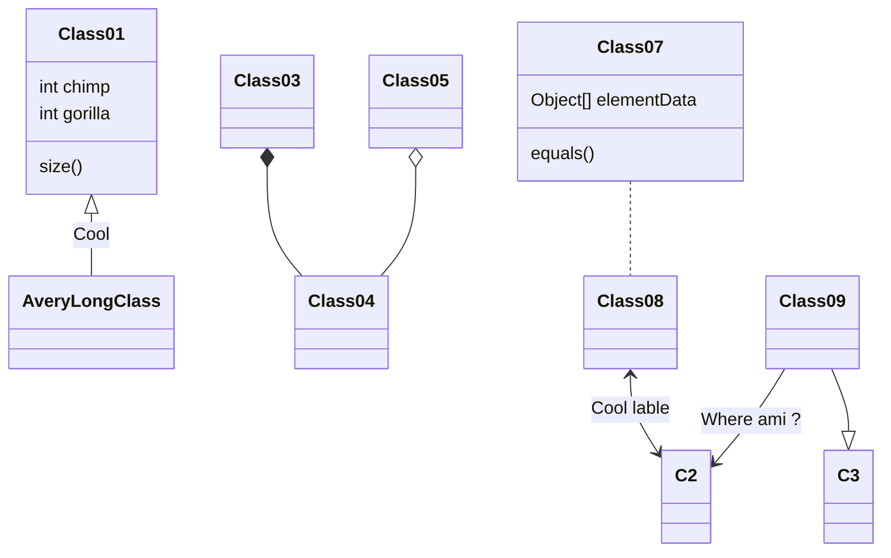
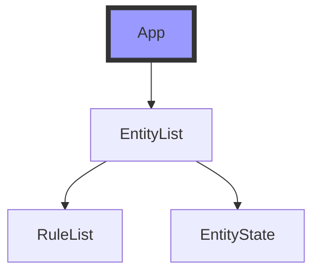

## 一


**示例**
```yaml
  <Badge text="beta" type="warning"/>
  <Badge text="Vdoing主题"/>
  
  
```

**效果**

<Badge text="beta" type="warning"/>
<Badge text="Vdoing主题"/>


## 二
**示例：**
```yaml

#### 《沁园春·雪》 <Badge text="摘"/>
北国风光<Badge text="注释" type="warning"/>，千里冰封，万里雪飘。

> <Badge text="译文" type="error" vertical="middle"/>: 北方的风光。

```

**效果：**
#### 《沁园春·雪》 <Badge text="摘"/>
北国风光<Badge text="注释" type="warning"/>，千里冰封，万里雪飘。
> <Badge text="译文" type="error" vertical="middle"/>: 北方的风光。


## 三
### 标题居中

**示例**

```yaml
<center> <font face="STCAIYUN" size=6 color=red> 标题居中 华文彩云字体 字体大小 字体颜色 </font> </center>
```


**效果**

## 标题居中 字体 字体大小 字体颜色
<center> <font face="STCAIYUN" size=6 color=red> 标题居中 华文彩云字体 字体大小 字体颜色 </font> </center>


## 三
### 图片居中

**示例**

```yaml
::: center

在线图片网址太长这么办？ 使用缩短网址生成器实现

[缩短网址生成器](https://reurl.cc/main/cn)


:::
```

**效果**
::: center

:::


## 四

### 折叠


**示例**

```yaml
  ::: details
  这是一个详情块

  :::
```
**效果**


::: details
这是一个详情块

```js
console.log('这是一个详情块')
```

:::

## 五
### MarkMap 思维导图

**示例：**
```yaml
<iframe :src="$withBase('https://markmap.js.org/repl')" width="100%" height="400" frameborder="0" scrolling="No" leftmargin="0" topmargin="0">
</iframe>
```
**效果：**
<iframe :src="$withBase('https://markmap.js.org/repl')" width="100%" height="400" frameborder="0" scrolling="No" leftmargin="0" topmargin="0">
</iframe>


##  processon思维导图

**processon效果：**

<iframe src="https://www.processon.com/view/link/5e718942e4b015182028682c" width="100%" height="500" frameborder="0" scrolling="No" leftmargin="0" topmargin="0"></iframe>

**效果：**

<iframe height="400" style="width: 100%;" scrolling="no" title="【CSS：行为】使用:hover和attr()定制悬浮提示" src="https://codepen.io/xugaoyi/embed/vYNKNaq?height=400&theme-id=light&default-tab=css,result" frameborder="no" allowtransparency="true" allowfullscreen="true" loading="lazy">
See the Pen <a href='https://codepen.io/xugaoyi/pen/vYNKNaq'>【CSS：行为】使用:hover和attr()定制悬浮提示</a> by xugaoyi
(<a href='https://codepen.io/xugaoyi'>@xugaoyi</a>) on <a href='https://codepen.io'>CodePen</a>.
</iframe>

## 六
### 多选标签

```yaml
    <code-group>
      <code-block title="YARN" active>
      ```bash
      yarn add vuepress-theme-vdoing -D
      ```
      </code-block>

      <code-block title="NPM">
      ```bash
      npm install vuepress-theme-vdoing -D
      ```
      </code-block>
    </code-group>
```
**效果：**

<code-group>
  <code-block title="YARN" active>
  ```bash
  yarn add vuepress-theme-vdoing -D
  ```
  </code-block>

  <code-block title="NPM">
  ```bash
  npm install vuepress-theme-vdoing -D
  ```
  </code-block>
</code-group>

## 七
## 插入音乐
**示例：**
```yaml
<iframe frameborder="no" border="0" marginwidth="0" marginheight="0" width=330 height=86 src="//music.163.com/outchain/player?type=2&id=528478901&auto=1&height=66"></iframe>
```
**效果**
<iframe frameborder="no" border="0" marginwidth="0" marginheight="0" width=330 height=86 src="//music.163.com/outchain/player?type=2&id=528478901&auto=1&height=66"></iframe>


## 八
## 插入视频
**示例：**

> 不支持优酷，可以用youtube。
> 插入Gif必须是在线https://的gif 本地路径的gif无法显示 
> 可以把本地的Gif上传到一个https://giphy.com/join?next=/create/gifmaker 网站上复制连接即可使用gif动图
```yaml 
<iframe width="560" height="315" src="https://v.qq.com/x/cover/mzc00200ets769l/j0042w9d0xy.html?n_version=2021" frameborder="0" allowfullscreen></iframe>

```
**效果**


<iframe width="560" height="315" src="https://v.qq.com/x/cover/mzc00200ets769l/j0042w9d0xy.html?n_version=2021" frameborder="0" allowfullscreen></iframe>


## 索引
<!-- TOC -->

- [VS code 配置 markdown+ PPT写作配置指南](#vs-code-配置-markdown-ppt写作配置指南)
  - [VScode 插件](#vscode-插件)
  - [图标快捷键显示](#图标快捷键显示)
  - [设置图像的长宽](#设置图像的长宽)
  - [定义尺寸](#定义尺寸)
  - [定义大小并剧中显示](#定义大小并剧中显示)
  - [插入本地图像](#插入本地图像)
  - [插入在线图片](#插入在线图片)
  - [超链接](#超链接)
  - [跳转链接](#跳转链接)
  - [表格](#表格)
  - [引用](#引用)
  - [分割线](#分割线)
  - [代码块](#代码块)
  - [复选框](#复选框)
  - [绘制流程图 Flowchart](#绘制流程图-flowchart)
  - [mermaid](#mermaid)
    - [时序图](#时序图)
  - [类图](#类图)
  - [多种矩阵形式输入](#多种矩阵形式输入)
- [带大括号的：](#带大括号的)
  - [带中括号的](#带中括号的)
  - [解决导出的HTML中文乱码问题](#解决导出的html中文乱码问题)
  - [Markdown语法](#markdown语法)

<!-- /TOC -->


# VS code 配置 markdown+ PPT写作配置指南

## VScode 插件
+ [Pandoc 通用文档转换器](https://www.pandoc.org/index.html)
+ [marp markdown编写PPT插件 ](https://marp.app/)
+ [Slidev PPT插件](https://cn.sli.dev/guide/)
+ Markdown All in One
    - 支持表格格式化Alt+Shift+f
+ Paste Image: vscode 粘图插件 快捷键  CTRL+Alt+v


+ 生成目录结构插件 Markdown TOC


+ Markdown Preview Enhanced
+ Atom One Dark Theme 主题颜色
+ Live Server
+ markmap 思维导图
+ Vscode Blink Mind 思维导图
  + 只支持 保存为 .blinkmind 和 .bm 后缀文件
+ vscode-mindmap 脑图 
  + 文件保存后缀.km会自动显示或者用快捷键ctrl/cmd + m显示, 
+ PlantUML 时序图
  + 文件后缀名*.pu, *.puml结尾,同时，还必须安装：Java 环境和Graphviz-Dot才能使用
---


**示例：**
```yaml
## 图标快捷键显示
使用 <kbd>Ctrl</kbd>+<kbd>Alt</kbd>+<kbd>Del</kbd> 重启电脑
```
**效果：**
## 图标快捷键显示
使用 <kbd>Ctrl</kbd>+<kbd>Alt</kbd>+<kbd>Del</kbd> 重启电脑

## 设置图像的长宽


## 定义尺寸


## 定义大小并剧中显示
<div align=center></div>

## 插入本地图像


## 插入在线图片
<a href="https://ibb.co/b50x1zq"></a>


## 超链接
[百度网址](https://www.baidu.com)

## 跳转链接
<a href="https://www.cnblogs.com/MeiCheng/" target="_blank">跳到自己博客列表</a> 


**示例：**
```yaml
## 表格
| 表头 | 左对齐--- | 居中  | ---右对齐 |
| ---- | :-------- | :---: | --------: |
```
**效果：**
## 表格
| 表头 | 左对齐--- | 居中  | ---右对齐 |
| ---- | :-------- | :---: | --------: |


## 引用
>一
>>二
>>>三

## 分割线
---

## 代码块
```bash
echo "Hello World!"
```

```python
print(hello world!)
```


## 复选框
- [x] 选择
- [ ] 未选择


## 绘制流程图 Flowchart
```flow
st=>start: Start
e=>end: 需求变更备案
op1=>operation: 需求基线确定|past
op2=>operation: 内部需求变更|current
op3=>operation: 下一个版本|current
op4=>operation: 与客户协商需求变更|current
op5=>operation: 更新需求文档|current
op6=>operation: 通知项目组开发和测试|current
op7=>operation: 客户需求变更流程|current
 
 
 
cond1=>condition: 是否对实际业务产生影响
cond2=>condition: 是否接受当前版本变更
 
st->op1(right)->op1(right)->op2->cond1
cond1(no)->cond2
cond1(yes)->op4->op7
cond2(yes)->op5
cond2(no)->op3
op5->op6
op6->e
```


## mermaid 



---




### 时序图
> 需要安装 PlantUML并配置本地环境才能使用
```PlantUML
@startuml test
== build ==
Main -> Builder: createEntity()
Builder -> EntityFactory: create()
EntityFactory -> Entity: constructor()
== run ==
Main -> Main: update()
Main -> Entity: update()
Entity -> Entity: render()
Entity -> Entity: emitEvent(EVENT_RENDER)
Entity --> Main: onRender()
@enduml
```

---

## 类图
> 需要安装 PlantUML并配置本地环境才能使用
```
@startuml test

Class ClassA {
    -- 属性 --
    +String publicAttr
    #int protectedAttr
    -long privateAttr
    .. 其他格式 ..
    +A: String
    #B: Number
    -C: Boolean
    == 方法 ==
    +getAttr()
    #setAttr()
    -readAttr()
}

note top: 在顶部注释说明

Class ClassB {

}

note right: 在右边注释说明

ClassA <-- ClassB:关联
ClassA <.. ClassB : 依赖
ClassA o-- ClassB:聚集
ClassA <|-- ClassB:泛化
ClassA <|.. ClassB:实现
@enduml
```


---

## 多种矩阵形式输入
$$\begin{matrix}
1&2 \\  3&4 \\ 5&6
\end{matrix}
$$

# 带大括号的：
$$\left\{
\begin{matrix}
1&2 \\  3&4 \\ 5&6
\end{matrix}
\right\}
$$

## 带中括号的

$$\left[
\begin{matrix}
1&2 \\  3&4 \\ 5&6
\end{matrix}
\right]
$$

## 解决导出的HTML中文乱码问题
- 须在编辑的markdown文件最开始添加如下代码，转换出来的HTML就不会出现中文乱码了

`<meta http-equiv="Content-Type" content="text/html; charset=utf-8" /> `

## Markdown语法
[markdown语法](http://blog.ruanyou.top/pages/ad247c4332211551/#%E5%9B%9B%E3%80%81%E6%A0%87%E9%A2%98)
